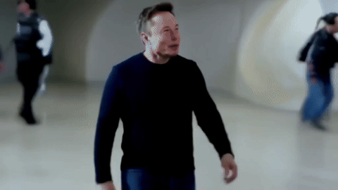
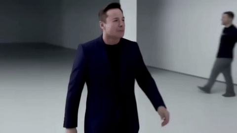

# Video-Unlearning
[](https://pinlab.org/video-unlearning)
[]([https://arxiv.org/abs/xxxx.xxxxx](https://arxiv.org/pdf/xxx.xxxxx))

> ## 🚧 Work in progress!
>
> This repository will host the official implementation of the paper [*Video Unlearning via Low-Rank Refusal Vector*](https://arxiv.org/pdf/xxxx.xxxxx). <br>
> Code will be made available soon... stay tuned! 🚀 <br>
> Feel free to **star** ⭐️  and **watch** 👁️ the repo to stay updated!

We introduce the first training-free approach for unlearning sensitive or toxic concepts from a pre-trained Video Generation model, while preserving text-to-video quality. 🔮 💫

----
### Qualitative examples

*"**Leonardo DiCaprio** waving."*

| ❌ Before (Baseline Model) | ✅ After (Unlearned Concept) |
|-------------------------|-----------------------------|
|  |  |

*"A barista brewing coffee using a **Nespresso** machine."*

| ❌ Before (Baseline Model) | ✅ After (Unlearned Concept) |
|-------------------------|-----------------------------|
|  |  |

*"A close-up of a **Rolex** watch under sunlight."*

| ❌ Before (Baseline Model) | ✅ After (Unlearned Concept) |
|-------------------------|-----------------------------|
|  |  |

*"A woman sipping coffee in a **Prada** sunglasses ad."*

| ❌ Before (Baseline Model) | ✅ After (Unlearned Concept) |
|-------------------------|-----------------------------|
|  |  |

*"**Elon Musk** walking."*

| ❌ Before (Baseline Model) | ✅ After (Unlearned Concept) |
|-------------------------|-----------------------------|
|  |  |

For more visualizations, check out our [project page](https://www.pinlab.org/video-unlearning).

## Announcements

- **2025-06-06**:  The repository is live! Code and models will be available soon: stay tuned!

## Citation

```bibtex
```